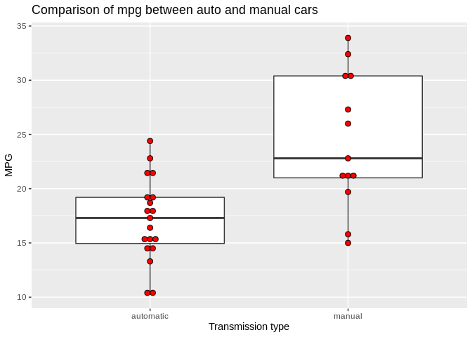
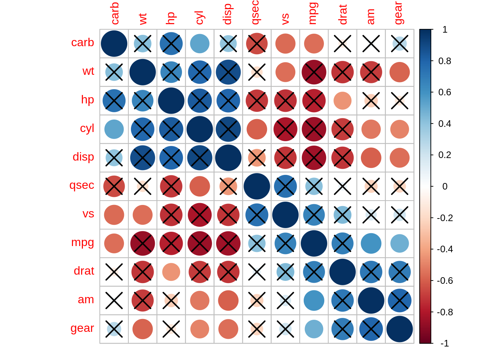
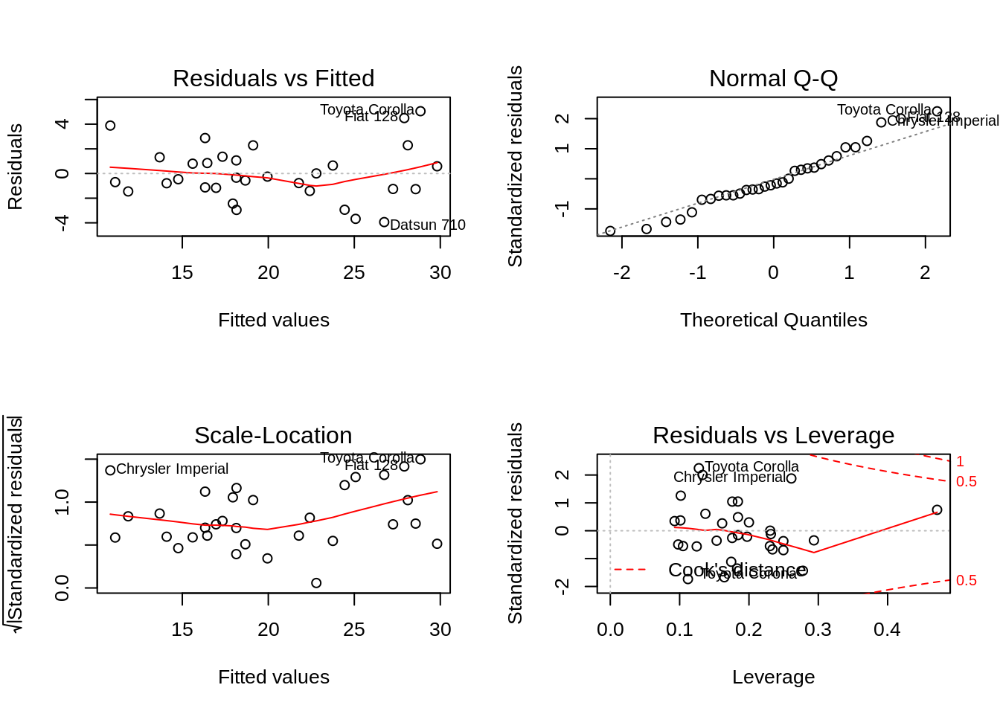

# Regression Model Analysis: can transmission type predict fuel efficiency of a car?

## Executive summary

The report uses `mtcars` data set to answer the following questions:

1.  Is an automatic or manual transmission better for MPG?
2.  How to quantify the MPG difference between automatic and manual
    transmissions?

After the analysis, I conclude that there is difference on miles per
gallon(mpg) between manual and automatic cars, but the difference can be
more affected by the weight, gross horspower and number of cylinders of
the car. Given all other variables held constant, I predict a manual car
is likely to have a better mpg, between 0.4 and 3.2 miles per gallon,
than a automatic car, at a confidence level of 80%.

## Data description

The data was extracted from the 1974 Motor Trend US magazine, and
comprises fuel consumption and 10 aspects of automobile design and
performance for 32 automobiles (1973–74 models).

  - mpg Miles/(US) gallon
  - cyl Number of cylinders
  - disp Displacement (cu.in.)
  - hp Gross horsepower
  - drat Rear axle ratio
  - wt Weight (1000 lbs)
  - qsec 1/4 mile time
  - vs Engine (0 = V-shaped, 1 = straight)
  - am Transmission (0 = automatic, 1 = manual)
  - gear Number of forward gears
  - carb Number of carburetors

## Data processing

``` r
mtcars2 = within(mtcars, {
   vs = factor(vs, labels = c("V", "S"))
   am = factor(am, labels = c("automatic", "manual"))
   cyl  = factor(cyl, ordered = F)
   gear = factor(gear, ordered = F)
   carb = factor(carb, ordered = F)
})
head(mtcars2)
```

    ##                    mpg cyl disp  hp drat    wt  qsec vs        am gear carb
    ## Mazda RX4         21.0   6  160 110 3.90 2.620 16.46  V    manual    4    4
    ## Mazda RX4 Wag     21.0   6  160 110 3.90 2.875 17.02  V    manual    4    4
    ## Datsun 710        22.8   4  108  93 3.85 2.320 18.61  S    manual    4    1
    ## Hornet 4 Drive    21.4   6  258 110 3.08 3.215 19.44  S automatic    3    1
    ## Hornet Sportabout 18.7   8  360 175 3.15 3.440 17.02  V automatic    3    2
    ## Valiant           18.1   6  225 105 2.76 3.460 20.22  S automatic    3    1

## Question1: Is an automatic or manual transmission better for MPG?

### Exploratory data analysis

``` r
library(ggplot2)
ggplot(mtcars2, aes(x=am, y=mpg)) +
  geom_boxplot() +
  geom_dotplot(binaxis = 'y', stackdir = 'center', fill = 'red', binwidth = 0.5) +
  labs(y='MPG', x= 'Transmission type') +
  ggtitle('Comparison of mpg between auto and manual cars')
```

<!-- -->

As shown boxplot, manual cars have a higher mpg in average than
automatic cars.

### Model Selection

1.  Using correlation

<!-- end list -->

``` r
library(corrplot)
```

    ## corrplot 0.84 loaded

``` r
m = cor(mtcars)

# mat : is a matrix of data
# ... : further arguments to pass to the native R cor.test function

cor.mtest = function(mat, ...) {
    mat = as.matrix(mat)
    n = ncol(mat)
    p.mat = matrix(NA, n, n)
    diag(p.mat) = 0
    for (i in 1:(n - 1)) {
        for (j in (i + 1):n) {
            tmp = cor.test(mat[, i], mat[, j], ...)
            p.mat[i, j] = p.mat[j, i] = tmp$p.value
        }
    }
  colnames(p.mat) = rownames(p.mat) = colnames(mat)
  p.mat
}

# matrix of the p-value of the correlation
p.mat = cor.mtest(mtcars)

corrplot(m, method='circle', order='hclust', p.mat=p.mat, sig.level='0.01')
```

<!-- -->

The correlation plot shows that mpg has correlation with am, gear and
carb at significance level of 0.01.

2.  Hypothesis testing

<!-- end list -->

``` r
t.test(mpg~am, data=mtcars2, var.equal=T)
```

    ## 
    ##  Two Sample t-test
    ## 
    ## data:  mpg by am
    ## t = -4.1061, df = 30, p-value = 0.000285
    ## alternative hypothesis: true difference in means is not equal to 0
    ## 95 percent confidence interval:
    ##  -10.84837  -3.64151
    ## sample estimates:
    ## mean in group automatic    mean in group manual 
    ##                17.14737                24.39231

Havinga a null hypothesis of those two transmission types are equally
efficient, the p-value, less than 0.05, implies the null hypothesis can
be rejected. Therefore, there is difference in fuel efficiency,
represented by mpg, between manual and automatic transmission.

3.  Information gain for variable selection

<!-- end list -->

``` r
library(FSelector)
att_scores = random.forest.importance(mpg~., mtcars2)
cutoff.biggest.diff(att_scores)
```

    ## [1] "disp" "wt"   "hp"   "cyl"

``` r
#cutoff.k(att_scores, k = 4)
#cutoff.k.percent(att_scores, 0.4)
```

FSelector package provides that wt, disp, hp and cyle are the best
features to predict mpg.

3.  Feature selection using wrappper
methods

<!-- end list -->

``` r
#library(MASS) #this can be achieved by using selectFeatures() fuction from  mlr package.
#stepAIC(lm(mpg ~., data=mtcars2), direction='backward', trace=FALSE)
step(lm(mpg ~ ., data = mtcars2), direction = 'backward', trace = 0) # stepwise backward elimination
```

    ## 
    ## Call:
    ## lm(formula = mpg ~ cyl + hp + wt + am, data = mtcars2)
    ## 
    ## Coefficients:
    ## (Intercept)         cyl6         cyl8           hp           wt     ammanual  
    ##    33.70832     -3.03134     -2.16368     -0.03211     -2.49683      1.80921

Using traditional methods, backward selection, the features that relate
to mpg are cyl, hp and wt

``` r
library(caret)
```

    ## Loading required package: lattice

``` r
mod_fit = lm(mpg~., mtcars2)
imp = as.data.frame(varImp(mod_fit))
imp = data.frame(overall = imp$Overall, names = rownames(imp))
head(imp[order(imp$overall,decreasing = T),]) # top 5 features
```

    ##      overall names
    ## 4  1.7883534    hp
    ## 6  1.7842573    wt
    ## 3  1.1143329  disp
    ## 1  0.8710262  cyl6
    ## 16 0.8672153 carb8
    ## 15 0.7013668 carb6

``` r
model = lm(mpg ~ am, data=mtcars2)
model1 = lm(mpg ~ wt + hp + disp + am, data=mtcars2)
anova(model, model1)
```

    ## Analysis of Variance Table
    ## 
    ## Model 1: mpg ~ am
    ## Model 2: mpg ~ wt + hp + disp + am
    ##   Res.Df    RSS Df Sum of Sq      F    Pr(>F)    
    ## 1     30 720.90                                  
    ## 2     27 179.91  3    540.99 27.063 2.715e-08 ***
    ## ---
    ## Signif. codes:  0 '***' 0.001 '**' 0.01 '*' 0.05 '.' 0.1 ' ' 1

``` r
model2 = lm(mpg ~ wt + hp + cyl + am, data=mtcars2)
anova(model, model2)
```

    ## Analysis of Variance Table
    ## 
    ## Model 1: mpg ~ am
    ## Model 2: mpg ~ wt + hp + cyl + am
    ##   Res.Df    RSS Df Sum of Sq      F    Pr(>F)    
    ## 1     30 720.90                                  
    ## 2     26 151.03  4    569.87 24.527 1.688e-08 ***
    ## ---
    ## Signif. codes:  0 '***' 0.001 '**' 0.01 '*' 0.05 '.' 0.1 ' ' 1

The first model only considers wt, hp and disp whereas the second model
considers wt, hp and cyl. Based on the RSS, I chose the model2. Also,
from the correlation plot, those variables seem independent to each
other, which makes a better model than including gear and carb in the
model.

  - wt correlates to vs and gear.
  - hp correlates to drat
  - cyl correlates to gear, qsec and am.

<!-- end list -->

``` r
par(mfrow=c(2,2))
plot(model2)
```

<!-- -->

Residuals are between -2 and 4 mpg, but appear random and normally
distributed.

## Question2: MPG difference between automatic and manual transmissions

``` r
summary(model2)
```

    ## 
    ## Call:
    ## lm(formula = mpg ~ wt + hp + cyl + am, data = mtcars2)
    ## 
    ## Residuals:
    ##     Min      1Q  Median      3Q     Max 
    ## -3.9387 -1.2560 -0.4013  1.1253  5.0513 
    ## 
    ## Coefficients:
    ##             Estimate Std. Error t value Pr(>|t|)    
    ## (Intercept) 33.70832    2.60489  12.940 7.73e-13 ***
    ## wt          -2.49683    0.88559  -2.819  0.00908 ** 
    ## hp          -0.03211    0.01369  -2.345  0.02693 *  
    ## cyl6        -3.03134    1.40728  -2.154  0.04068 *  
    ## cyl8        -2.16368    2.28425  -0.947  0.35225    
    ## ammanual     1.80921    1.39630   1.296  0.20646    
    ## ---
    ## Signif. codes:  0 '***' 0.001 '**' 0.01 '*' 0.05 '.' 0.1 ' ' 1
    ## 
    ## Residual standard error: 2.41 on 26 degrees of freedom
    ## Multiple R-squared:  0.8659, Adjusted R-squared:  0.8401 
    ## F-statistic: 33.57 on 5 and 26 DF,  p-value: 1.506e-10

After the model selection process, the features of wt, hp and cyl,
especially between 4 and 6 cylinders, should be considered to prediect
the value of mpg as to the transmission type. Given the sample size is
small, it’s common to have only few significant predictors of mpg.
However, I would conculde that considering the transmission type alone
cannot make a decision whethet having a better mpg. Having 1.80921 mpg
of cofficient at Pr(\>|t|) of 0.20646, I estimate given the other
variables are constant, a manual car can have a better average mpg of
1.8092 than a automatic car with a confidence level of 0.7935.
